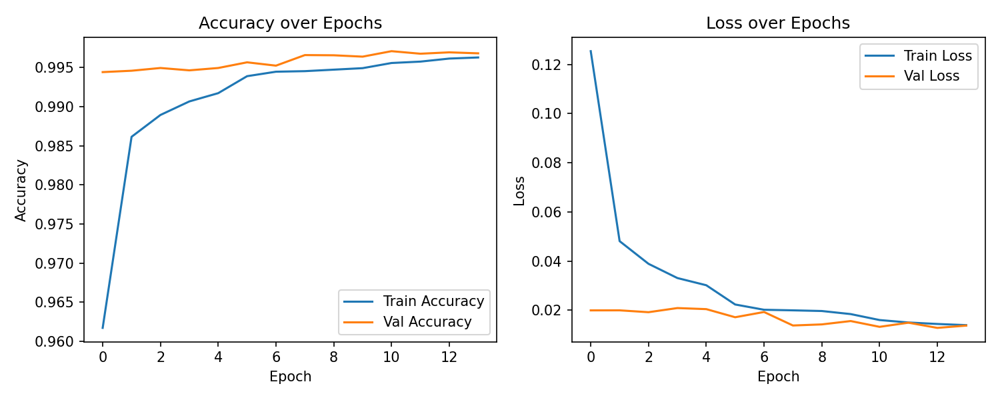
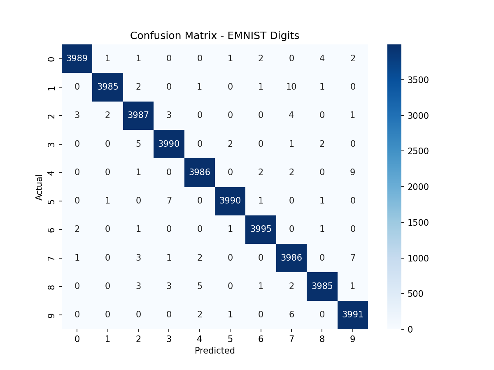

# Handwritten Digit Recognition — CNN + Flask + ONNX Runtime

A web-based handwritten digit recognition system. Users draw a digit (0–9) on an in-browser canvas, and a CNN trained on the **EMNIST Digits** dataset predicts the digit along with a confidence score, served through a Flask backend using **ONNX Runtime** for inference.

---

## Overview

This project demonstrates a complete, practical machine learning workflow — from dataset preparation and CNN training to deployment in a lightweight, cross-platform web application. It started as a straightforward MNIST + TensorFlow + Flask proposal, and evolved through several real deployment constraints into its current architecture. See [Project Evolution](#project-evolution) below for the full story.

---

## Features

- Draw digits with mouse or touch on an interactive HTML canvas
- Flask REST API for prediction
- Fast, lightweight inference via ONNX Runtime (no TensorFlow required at inference time)
- Returns predicted digit + confidence score
- Cross-platform: runs on standard servers as well as constrained environments like Debian Proot on ARM64 (Android/Termux)

---

## Architecture

```
EMNIST Digits Dataset
        ↓
CNN Training (Kaggle, 2× Tesla T4 GPU)
        ↓
Model Evaluation
        ↓
Export: .keras → ONNX
        ↓
Flask Backend
        ↓
ONNX Runtime (inference only)
        ↓
Prediction API
        ↓
Browser Drawing Canvas
```

---

## Technology Stack

| Component | Technology |
|---|---|
| Language | Python |
| Backend | Flask, flask-cors |
| Model Architecture | Convolutional Neural Network (CNN) |
| Training Framework | TensorFlow / Keras |
| Dataset | EMNIST Digits |
| Training Platform | Kaggle Notebooks (2× Tesla T4 GPU) |
| Model Format | ONNX |
| Inference Engine | ONNX Runtime |
| Frontend | HTML, CSS, JavaScript |
| Deployment Target | Debian Proot (ARM64), Python 3.13, Termux |

---

## Project Structure

```
digit_ai/
│
├── app.py
│
├── model/
│   └── digit_model.onnx
│
├── templates/
│   └── index.html
│
├── training/
│   └── train_emnist.ipynb
│
├── assets/
│   ├── training_curves.png
│   └── confusion_matrix.png
│
├── requirements.txt
└── README.md
```

---

## Setup

```bash
pip install -r requirements.txt
python app.py
```

**requirements.txt**
```
flask
flask-cors
onnxruntime
numpy
pillow
```

---

## Model Details

- **Dataset:** EMNIST Digits — 240,000 training samples, 40,000 test samples, 28×28 grayscale images
- **Architecture:**
  - Input
  - Random Rotation / Translation / Zoom (augmentation)
  - Conv2D (32) → MaxPooling
  - Conv2D (64) → MaxPooling
  - Conv2D (128)
  - Flatten
  - Dense (256) → Dropout (0.4)
  - Dense (10, Softmax)
  - Total params: 1,701,130 (6.49 MB)
- **Optimizer:** Adam
- **Loss:** Sparse Categorical Crossentropy
- **Callbacks:** EarlyStopping (patience 3, restore best weights), ReduceLROnPlateau (factor 0.5, patience 2)
- **Batch size:** 128, max 20 epochs
- **Final test accuracy:** **99.73%**
- **Final test loss:** ≈ 0.014

### Training Curves


### Confusion Matrix


The confusion matrix shows near-perfect separation across all 10 digit classes, with misclassifications concentrated in a small number of visually ambiguous cases.

---

## Project Evolution

### Initial Proposal
The original plan used the **MNIST** dataset, trained a TensorFlow/Keras CNN in Google Colab, and deployed it directly inside Flask using TensorFlow for inference.

### Why the dataset changed
MNIST-trained models struggled with curved/stylistically varied digit strokes. The project moved to **EMNIST Digits**, a larger and more challenging handwritten dataset, to produce a more capable and robust CNN.

### Why the training platform changed
Training EMNIST via TensorFlow Datasets (TFDS) in Google Colab repeatedly failed with protobuf/dependency conflicts (incompatible protobuf gencode/runtime versions, clashes between `tensorflow`, `tensorflow-text`, `tf-keras`, and related packages). Colab training also proved too slow/laggy for the larger dataset.

The fix was to bypass TFDS entirely: the official EMNIST IDX files were downloaded manually from NIST and loaded with `idx2numpy`, avoiding the dependency conflicts altogether. Image orientation also needed correcting (EMNIST images are stored rotated/mirrored relative to MNIST) — this was fixed with a rotation + horizontal flip + normalization preprocessing step, verified visually before training.

Training itself was then moved to **Kaggle Notebooks** (2× Tesla T4 GPUs), which gave a more stable environment and much faster execution than Colab.

### Why the deployment format changed
The original plan loaded the `.keras` model directly into Flask using TensorFlow. However, the deployment target — **Android / Termux / Debian Proot, Python 3.13, ARM64** — has very limited TensorFlow support, and TensorFlow Lite has no compatible runtime package for Python 3.13 on ARM64 either.

To solve this, the trained model was exported to **ONNX** and served with **ONNX Runtime** instead, which is lightweight, portable, and runs cleanly in the target environment without pulling in TensorFlow as a runtime dependency.

```
Original:  .keras → TensorFlow → Flask
Final:     .keras → ONNX → Flask → ONNX Runtime
```

---

## Current Status

- ✅ CNN trained on EMNIST Digits (99.73% test accuracy)
- ✅ Model converted to ONNX
- ✅ Flask backend completed
- ✅ ONNX Runtime integrated
- ✅ Training notebook, accuracy/loss curves, and confusion matrix documented
- 🔄 Web frontend under development

**Version:** v1.0 (Development Build)

---

## Future Improvements

- Automatic digit centering
- Improved preprocessing pipeline
- Dark mode
- Prediction probability graph (all 10 classes)
- Real-time prediction while drawing
- Progressive Web App (PWA) support
- Extend recognition to letters/symbols (EMNIST alphabet classes)

---

## Lessons Learned

- TensorFlow Datasets (TFDS) can introduce hard-to-resolve protobuf/dependency conflicts in some Colab environments — manual IDX loading is a simpler, more reliable alternative for EMNIST.
- Always visually verify dataset image orientation before training — EMNIST is stored differently from MNIST.
- Kaggle Notebooks offered a more stable, faster GPU environment than Colab for this workload.
- TensorFlow (and TensorFlow Lite) have limited support on Python 3.13 / ARM64 — ONNX + ONNX Runtime is a far more portable deployment path for constrained environments.
- Always download trained model artifacts (and commit a saved, fully-run notebook version) before ending a cloud training session.
